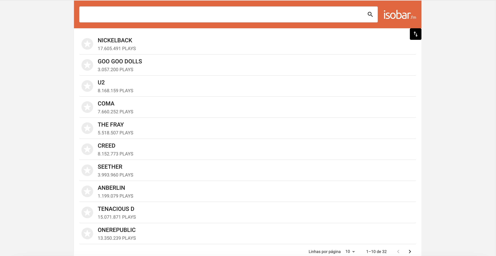
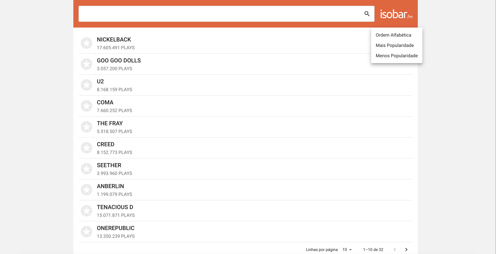
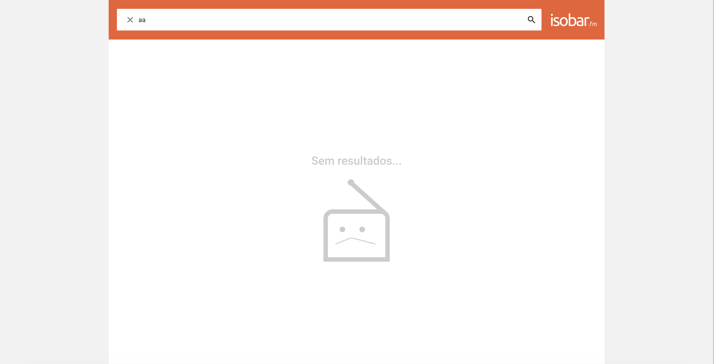
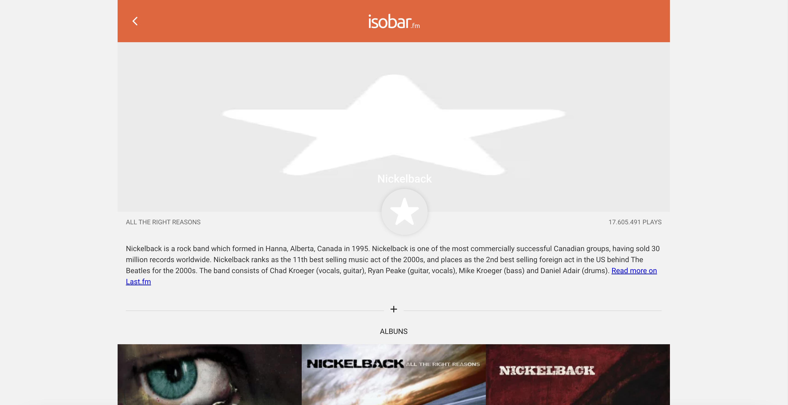

## 💻 Project

Web App for viewing your favorite bands and their albums

## :rocket: Technologies

This project was developed with the following technologies:

- [Vite](https://vitejs.dev/)
- [React](https://reactjs.org)
- [Material UI](https://mui.com/)
- [React Router Dom](https://reactrouter.com/en/main)
- [Axios](https://axios-http.com/ptbr/docs/intro)
- [Vitest](https://vitest.dev/)

## :information_source: How To Use

To clone and run this application, you'll need [Git](https://git-scm.com), [Node.js][nodejs] installed on your computer.

### Screens

<p align="center">
  
  
  
  
</p>

From your command line:

### Add a .ENV configuration file

```bash
create an .env file in the root of your project and add your VITE_BACKEND_API_URL as in the .env.example file.

```

### Install App

```bash
# Clone this repository
$ git clone https://github.com/ViniCleFer/isobar-fm.git

# Install dependencies
$ npm install or yarn

# Run the APP
$ npm run dev or yarn dev

# Run tests
$ npm run test or yarn test
```

[vite]: https://vitejs.dev/
[nodejs]: https://nodejs.org/
[yarn]: https://yarnpkg.com/
[vc]: https://code.visualstudio.com/
[vceditconfig]: https://marketplace.visualstudio.com/items?itemName=EditorConfig.EditorConfig
[vceslint]: https://marketplace.visualstudio.com/items?itemName=dbaeumer.vscode-eslint
[prettier]: https://marketplace.visualstudio.com/items?itemName=esbenp.prettier-vscode
[react]: https://reactjs.org
[materialui]: https://mui.com/
[reactrouterdom]: https://reactrouter.com/en/main
[axios]: https://axios-http.com/ptbr/docs/intro
[vitest]: https://vitest.dev/
